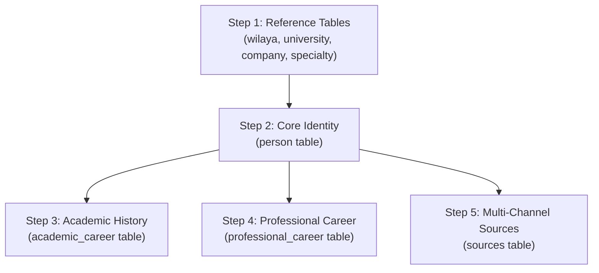

# Rawabit Platform: Data Collection & Entry Blueprint

**Document Version:** 2.0 (Production Release)  
**Target Audience:** Data Collection Team, Quality Assurance Auditors, Registry Operators  
**Database Engine:** Supabase PostgreSQL (`rawabit-prod`)  
**Scope:** Relational Schema Mapping, Step-by-Step Data Entry Protocols, and Verified Dossier Standards.

---

## 1. UI-to-Database Mapping (The "Empty Card" Resolution)

Every visual card and node in the Rawabit interface is dynamically bound to specific tables and columns in Supabase. The table below provides the authoritative field-level mapping.

```
┌────────────────────────────────────────────────────────────────────────┐
│                        EXPERT DOSSIER STAGE                            │
│                                                                        │
│  ┌──────────────────────┐  ┌──────────────────┐  ┌──────────────────┐  │
│  │   ACADEMIC SATELLITE │  │   CENTER CARD    │  │ CAREER SATELLITE │  │
│  │   academic_career    │  │   person + wilaya│  │   prof_career    │  │
│  │   + university       │  │   + sources      │  │   + company      │  │
│  │   + specialty        │  │                  │  │                  │  │
│  └──────────────────────┘  └──────────────────┘  └──────────────────┘  │
│                                      │                                 │
│                                      ▼                                 │
│                        ┌──────────────────────────┐                    │
│                        │   SOURCING TREE NODES    │                    │
│                        │   sources table          │                    │
│                        │   (LinkedIn/GitHub/...)  │                    │
│                        └──────────────────────────┘                    │
└────────────────────────────────────────────────────────────────────────┘
```

---

### A. Center Main Card & Profile Grid Cards

| UI Element / Field | Source Table | Source Column(s) | Fallback / Logic Rules |
| :--- | :--- | :--- | :--- |
| **Full Name (EN/FR)** | `person` | `first_name` + `last_name` | Concatenated with space |
| **Full Name (AR)** | `person` | `first_name_ar` + `last_name_ar` | Used in Arabic locale (`dir="rtl"`) |
| **Primary Title / Role** | `professional_career` / `person` | `role` (latest by `start_date`) or `person.bio` | First sentence of `bio` if no career record exists |
| **Organization Name** | `company` | `company.name` / `company.name_ar` | Joined via `professional_career.company_id` |
| **Wilaya Badge** | `wilaya` | `wilaya.code`, `wilaya.name_ar`, `wilaya.name_fr` | Joined via `person.wilaya_id = wilaya.id` |
| **Avatar Graphic** | `person` | `photo_url` | If empty/invalid, generates luxury SVG geometric monogram |
| **Verification Tier** | Computed | `gold` / `silver` / `bronze` | • **Gold (Verified Expert)**: Has Bio + Academic Record + Professional Record<br>• **Silver (Confirmed Talent)**: Has Bio + Academic or Professional Record<br>• **Bronze (Registered Profile)**: Bio only |
| **Executive Bio** | `person` | `bio` | Text description of competencies and research scope |

---

### B. Academic & Research Satellite Node (Top-Left)

| UI Element / Field | Source Table | Source Column(s) | Sample Target Value |
| :--- | :--- | :--- | :--- |
| **Degree Level** | `academic_career` | `degree` | `Doctorate / Ph.D.`, `Magister`, `Ingénieur`, `Master` |
| **Specialized Discipline**| `specialty` | `name_ar`, `name_fr`, `name_en` | Joined via `academic_career.specialty_id = specialty.id` |
| **University / Institute** | `university` | `name_ar`, `name_fr`, `abbreviation` | Joined via `academic_career.university_id = university.id` |
| **Graduation Years** | `academic_career` | `start_year`, `end_year` | Formatted as `YYYY — YYYY` |
| **Thesis Title / Research**| `academic_career` | `thesis_title` | Research project or doctoral dissertation title |

---

### C. Professional & Industry Career Satellite Node (Bottom-Left)

| UI Element / Field | Source Table | Source Column(s) | Sample Target Value |
| :--- | :--- | :--- | :--- |
| **Position / Title** | `professional_career` | `role` | `Research Director`, `Chief Architect`, `Senior Professor` |
| **Company / Institute** | `company` | `name`, `name_ar`, `sector` | Joined via `professional_career.company_id = company.id` |
| **Tenure / Period** | `professional_career` | `start_date`, `end_date` | Formatted as `2015 — Present` or `2018 — 2023` |
| **Core Responsibilities** | `professional_career` | `description` | Summary of technical practice and deliverables |

---

### D. Interactive Sourcing Tree & Verification Nodes (Center Bottom)

| UI Element / Channel | Source Table | Source Column(s) | Criteria / Output Format |
| :--- | :--- | :--- | :--- |
| **LinkedIn Verified Node**| `sources` | `source_type = 'linkedin'`, `source_url` | URL matching `https://www.linkedin.com/in/*` |
| **GitHub Repositories** | `sources` | `source_type = 'github'`, `source_url` | URL matching `https://github.com/*` |
| **Google Scholar Node** | `sources` | `source_type = 'scholar'`, `source_url` | URL matching `https://scholar.google.com/*` |
| **ResearchGate / ORCID** | `sources` | `source_type = 'researchgate'`, `source_url` | Academic citation portal links |
| **Direct Verified Email** | `person` / `sources` | `person.email` or `source_type = 'email'` | Generates `mailto:` button with verified security indicator |
| **Portfolio / Lab Web** | `sources` | `source_type = 'website'`, `source_url` | Personal laboratory or project portal |
| **Reliability Score** | `sources` | `reliability_score` (1–100) | `100` = Verified by sovereign institution |

---

## 2. The Exact Data Entry Sequence (Relational Guide)

Because PostgreSQL enforces relational foreign keys, entries must follow an exact chronological sequence. **Inserting a person before their referenced institutions will cause foreign key constraint errors.**



---

### Step 1: Pre-populate Reference Tables (If not already present)
1. **`wilaya`**: Verify the target 2-digit Wilaya exists (`id: 1` to `58`).
2. **`university`**: If the person graduated from an institution not yet in the system, insert it first:
   - Fields: `name_ar`, `name_fr`, `abbreviation`, `wilaya_id`, `type: 'Public'`, `website`.
3. **`company`**: If the company or research center is new, create it first:
   - Fields: `name`, `name_ar`, `sector`, `wilaya_id`, `website`.
4. **`specialty`**: Ensure the scientific discipline exists:
   - Fields: `name_ar`, `name_fr`, `name_en`, `domain`.

---

### Step 2: Insert the Core Talent Record (`person` table)
- Navigate to **Table Editor → `person` → Insert row**.
- Fill all identity attributes:
  - `first_name`: Latin first name (e.g. `Taha`)
  - `last_name`: Latin last name (e.g. `Zerrouki`)
  - `first_name_ar`: Arabic first name (e.g. `طه`)
  - `last_name_ar`: Arabic last name (e.g. `زروقي`)
  - `email`: Institutional/corporate email address (e.g. `t.zerrouki@univ-bouira.dz`)
  - `wilaya_id`: Numeric ID of the Wilaya (e.g. `10` for Bouira, `16` for Algiers)
  - `bio`: Rich summary of competencies and research scope (minimum 25 words to qualify for Gold tier).
  - `photo_url`: Clean avatar URL or leave NULL (SVG monogram generator handles fallback).
- **Copy the generated `id` (UUID)**. This UUID is required for Steps 3, 4, and 5.

---

### Step 3: Insert Academic Qualifications (`academic_career` table)
- Navigate to **Table Editor → `academic_career` → Insert row**.
- Fill:
  - `person_id`: Paste the UUID from Step 2.
  - `university_id`: Select the ID from the `university` table.
  - `specialty_id`: Select the ID from the `specialty` table.
  - `degree`: E.g. `Doctorate / Ph.D.`, `Magister`, `Ingénieur`.
  - `start_year`: Integer (e.g. `2006`).
  - `end_year`: Integer (e.g. `2012`).
  - `thesis_title`: Name of the dissertation/research project.

---

### Step 4: Insert Professional Appointments (`professional_career` table)
- Navigate to **Table Editor → `professional_career` → Insert row**.
- Fill:
  - `person_id`: Paste the UUID from Step 2.
  - `company_id`: Select the ID from the `company` table.
  - `role`: Professional title (e.g. `Associate Professor & NLP Research Director`).
  - `start_date`: Date formatted `YYYY-MM-DD` (e.g. `2012-09-01`).
  - `end_date`: Leave `NULL` if currently employed, or set departure date.
  - `description`: Summary of leadership and technical achievements.

---

### Step 5: Insert Verified Sourcing Channels (`sources` table)
- Navigate to **Table Editor → `sources` → Insert row** for each channel:
  - **LinkedIn Row**: `person_id: UUID`, `source_type: 'linkedin'`, `source_url: 'https://www.linkedin.com/in/...'`, `reliability_score: 100`.
  - **GitHub Row**: `person_id: UUID`, `source_type: 'github'`, `source_url: 'https://github.com/...'`, `reliability_score: 95`.
  - **Google Scholar Row**: `person_id: UUID`, `source_type: 'scholar'`, `source_url: 'https://scholar.google.com/...'`, `reliability_score: 100`.
  - **Personal Portal Row**: `person_id: UUID`, `source_type: 'website'`, `source_url: 'https://...'`, `reliability_score: 90`.

---

## 3. Concrete Example: Step-by-Step Entry for "Dr. Taha Zerrouki"

Below is the verified data payload to insert a dossier for **Dr. Taha Zerrouki**.

### Step 1: Reference Prerequisites
```sql
-- Ensure University exists
SELECT id FROM university WHERE abbreviation = 'ESI' OR name_ar LIKE '%البويرة%';
-- University of Bouira = ID 12
-- National Higher School of Computer Science (ESI) = ID 5

-- Ensure Specialty exists
SELECT id FROM specialty WHERE name_en = 'Computer Science' OR name_ar LIKE '%إعلام آلي%';
-- Computer Science / NLP = ID 1
```

---

### Step 2: `person` Table Row
```json
{
  "id": "bc37ed80-8b2d-4359-ad48-4dfabced54d9",
  "first_name": "Taha",
  "last_name": "Zerrouki",
  "first_name_ar": "طه",
  "last_name_ar": "زروقي",
  "email": "t.zerrouki@univ-bouira.dz",
  "phone": "+213 26 93 00 00",
  "date_of_birth": "1978-05-14",
  "wilaya_id": 10,
  "bio": "Associate Professor in Computer Science & Natural Language Processing (NLP) at University of Bouira / ESI. Creator of PyArabic, Mishkal, Tashaphy, Qalsadi, and pioneer in Arabic computational linguistics algorithms.",
  "photo_url": "https://avatars.githubusercontent.com/u/1083980?v=4"
}
```

---

### Step 3: `academic_career` Table Rows
```json
[
  {
    "person_id": "bc37ed80-8b2d-4359-ad48-4dfabced54d9",
    "university_id": 5,
    "specialty_id": 1,
    "degree": "Doctorate / Ph.D.",
    "start_year": 2006,
    "end_year": 2012,
    "thesis_title": "Algorithms for Arabic Morphological Analysis, Stemming, and Diacritization"
  },
  {
    "person_id": "bc37ed80-8b2d-4359-ad48-4dfabced54d9",
    "university_id": 5,
    "specialty_id": 1,
    "degree": "Magister",
    "start_year": 2001,
    "end_year": 2005,
    "thesis_title": "Rule-Based Natural Language Processing Models for Semitic Languages"
  }
]
```

---

### Step 4: `professional_career` Table Rows
```json
[
  {
    "person_id": "bc37ed80-8b2d-4359-ad48-4dfabced54d9",
    "company_id": 3,
    "role": "Associate Professor & NLP Research Director",
    "start_date": "2012-09-01",
    "end_date": null,
    "description": "Leading research laboratory on Arabic Natural Language Processing, supervising doctoral candidates, and directing open-source computational linguistics frameworks."
  }
]
```

---

### Step 5: `sources` Table Rows
```json
[
  {
    "person_id": "bc37ed80-8b2d-4359-ad48-4dfabced54d9",
    "source_type": "linkedin",
    "source_url": "https://www.linkedin.com/in/taha-zerrouki",
    "reliability_score": 100,
    "verified_by": "Rawabit Sovereign Auditor",
    "notes": "Verified official LinkedIn identity"
  },
  {
    "person_id": "bc37ed80-8b2d-4359-ad48-4dfabced54d9",
    "source_type": "github",
    "source_url": "https://github.com/linuxscout",
    "reliability_score": 100,
    "verified_by": "Rawabit Sovereign Auditor",
    "notes": "Verified creator of PyArabic and Tashaphy repos"
  },
  {
    "person_id": "bc37ed80-8b2d-4359-ad48-4dfabced54d9",
    "source_type": "scholar",
    "source_url": "https://scholar.google.com/citations?user=taha-zerrouki",
    "reliability_score": 100,
    "verified_by": "Ministry of Higher Education Registry",
    "notes": "Official Google Scholar research citation profile"
  },
  {
    "person_id": "bc37ed80-8b2d-4359-ad48-4dfabced54d9",
    "source_type": "website",
    "source_url": "https://tahazerrouki.github.io",
    "reliability_score": 95,
    "verified_by": "Rawabit Sovereign Auditor",
    "notes": "Personal academic and computational research portal"
  }
]
```

---

## 4. Quality Checklist for Data Operators

Before marking any expert profile as complete, verify:
- [x] **Latin & Arabic Names**: Both script variations are accurately spelled with diacritics where appropriate.
- [x] **Valid Wilaya Code**: Foreign key correctly points to the expert's primary academic/operational Wilaya (`1`–`58`).
- [x] **No Placeholder Strings**: Do not enter `N/A`, `unknown`, or `test`. Leave optional fields as `NULL` instead.
- [x] **At Least 2 Sourcing Channels**: Ensure at least one professional network (LinkedIn) and one verifiable output (GitHub, Google Scholar, or Direct Institutional Email) are attached.
- [x] **Gold Tier Eligibility**: Verify that the record contains at least one `academic_career` row and one `professional_career` row to automatically activate the Gold Verified Expert badge in the UI.
